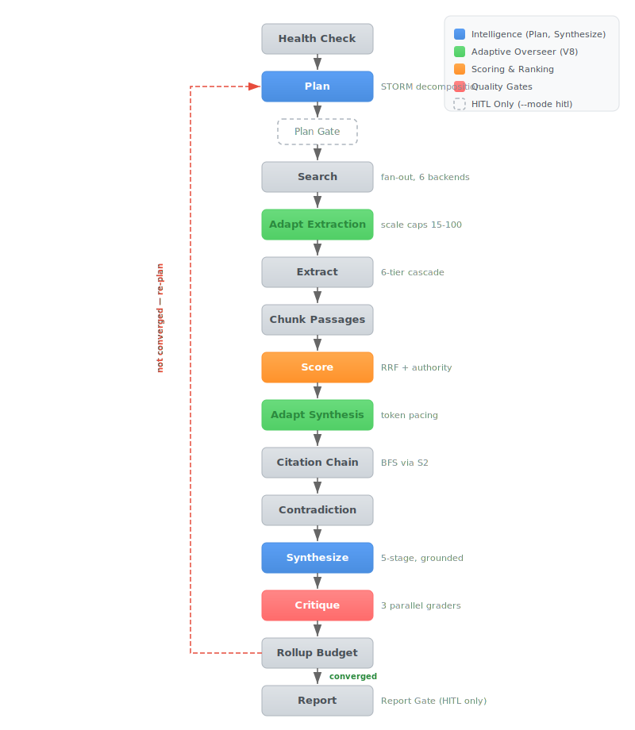
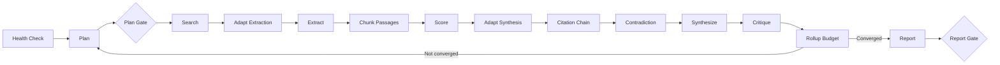

<div align="center">

# Deep Research Swarm

**Question in. Cited report out.**

*Multi-agent deep research powered by [LangGraph](https://github.com/langchain-ai/langgraph) + Claude*

<p>
  <a href="https://github.com/Darv0n/deep-research-swarm/actions/workflows/ci.yml"></a>
  
  
  
  
  
</p>

<p>
  <a href="#quick-start">Quick Start</a>
  <span>&nbsp;&nbsp;&bull;&nbsp;&nbsp;</span>
  <a href="#architecture">Architecture</a>
  <span>&nbsp;&nbsp;&bull;&nbsp;&nbsp;</span>
  <a href="CHANGELOG.md">Changelog</a>
  <span>&nbsp;&nbsp;&bull;&nbsp;&nbsp;</span>
  <a href="CONTRIBUTING.md">Contributing</a>
  <span>&nbsp;&nbsp;&bull;&nbsp;&nbsp;</span>
  <a href="https://github.com/Darv0n/deep-research-swarm/issues">Issues</a>
</p>

</div>

---

Takes a research question, decomposes it via STORM-style perspective-guided questioning, dispatches parallel search agents across 6 backends (including scholarly APIs and web archives), synthesizes findings through outline-first grounded synthesis with passage-level verification, critiques through a three-grader chain, and iterates until convergence. Produces structured Markdown reports with passage-level citations, confidence heat maps, provenance tracking, and gap analysis.

## Quick Start

```bash
# Clone and install
git clone https://github.com/Darv0n/deep-research-swarm.git
cd deep-research-swarm
python -m venv .venv && source .venv/bin/activate  # .venv\Scripts\activate on Windows
pip install -e ".[dev]"

# Configure
cp .env.example .env       # Edit .env — set ANTHROPIC_API_KEY (required)

# Start SearXNG (local meta-search engine)
docker compose -f docker/docker-compose.yml up -d

# Run
python -m deep_research_swarm "What is quantum entanglement?"
```

> [!TIP]
> Add `--academic` for scholarly research with OpenAlex + Semantic Scholar backends and BFS citation chaining:
> ```bash
> python -m deep_research_swarm --academic "CRISPR gene editing for metabolic disorders"
> ```

## Features

- **Multi-backend search** — SearXNG, Exa, Tavily, OpenAlex, Semantic Scholar, Wayback Machine
- **Scholarly research** — OpenAlex (250M+ works), Semantic Scholar citation chaining (BFS graph traversal)
- **Adaptive overseer** — Deterministic control loop that scales 15 tunables mid-run based on pipeline metrics
- **Grounded synthesis** — Passage-level mechanical verification (Jaccard + embedding + neighborhood methods)
- **Three-grader critique** — Parallel evaluation: relevance, hallucination, quality (Sonnet, 5x cost reduction)
- **Multi-iteration convergence** — Re-plans to address gaps and weak sections until quality thresholds met
- **Human-in-the-loop** — Plan and report gates via LangGraph `interrupt()` (`--mode hitl`)
- **Checkpoint resume** — SQLite or PostgreSQL persistence, `--resume` to continue interrupted runs
- **Cross-session memory** — JSON-backed Jaccard search, MCP export, research context across runs
- **Provenance tracking** — Content hashes, access timestamps, PROV-O JSON-LD export (W3C standard)
- **Claim graph** — Section claims linked to source passages via citation map
- **OCR/GROBID** — Scanned PDF support via GROBID TEI extraction + PaddleOCR fallback

## Architecture

<p align="center">
  
</p>

**Model tiering**: Opus handles planning, synthesis, and report generation. Sonnet handles the three critic graders (5x cost reduction for structured evaluation). **State management**: LangGraph StateGraph with annotated reducers — accumulating fields use `operator.add`, overwrite fields use replace-last-write semantics.

<details>
<summary><b>Pipeline Graph (Mermaid source)</b></summary>



```
health_check → plan → [plan_gate] → search → adapt_extraction → extract → chunk_passages
→ score → adapt_synthesis → citation_chain → contradiction → synthesize → critique
→ rollup_budget → [converge?] → report → [report_gate]
```

</details>

<details open>
<summary><b>How It Works</b></summary>

Given a research question, the system:

1. **Decomposes** the question into 3+ sub-queries from diverse perspectives (STORM method)
2. **Routes** each sub-query to appropriate backends based on query type (academic, technical, archival, general)
3. **Searches** each sub-query in parallel across configured backends
4. **Adapts extraction** — overseer scales extraction cap (15-100) and results per query based on search volume
5. **Extracts** clean content from result URLs via a 6-tier cascade (with Wayback fallback for 404s)
6. **Chunks** extracted documents into source passages with deterministic content-hash IDs
7. **Scores** documents using Reciprocal Rank Fusion + enhanced authority classification
8. **Adapts synthesis** — overseer scales citation budget, section count, and refinement attempts based on corpus size and token spend rate
9. **Chains** citations via BFS traversal of the Semantic Scholar citation graph
10. **Detects** contradictions between sources
11. **Synthesizes** via outline-first pipeline: generate outline, draft sections in parallel with passage-narrowed context, mechanically verify grounding, refine failed sections, compose report
12. **Critiques** each section across three dimensions: relevance, hallucination, quality
13. **Iterates** if quality is insufficient — re-plans to address gaps and weak sections
14. **Renders** a final Markdown report with provenance, bibliography, confidence heat map, and gap analysis

</details>

<details>
<summary><b>Pipeline Stages</b></summary>

### Planner

STORM-style decomposition: identifies 3 diverse perspectives on the question, then generates 1-2 specific search queries per perspective. On re-iterations, receives previous queries and identified gaps — generates new queries that address gaps without repeating prior searches. Programmatic deduplication via Jaccard similarity (threshold 0.7) + substring containment prevents redundant queries.

### Searcher

Dispatches sub-queries in parallel across all configured backends using LangGraph's `Send` API. Each backend returns ranked results with metadata (title, URL, snippet, authority classification).

### Extractor

Extracts clean content from result URLs using a six-tier cascade:

| Priority | Extractor | Use Case |
|:--------:|-----------|----------|
| 1 | PyMuPDF4LLM | PDF documents |
| 2 | GROBID | Structured PDF extraction (sections + references) |
| 3 | PaddleOCR | Scanned/image-only PDFs |
| 4 | Crawl4AI | JavaScript-rendered pages, SPAs |
| 5 | Trafilatura | Static HTML (fallback) |
| 6 | Wayback Machine | Dead links, 404 recovery |

Extraction cap scaled dynamically by the adaptive overseer (15-100 URLs per iteration).

### Scorer

Combines two scoring signals:

- **Reciprocal Rank Fusion (RRF)**: Merges rankings from multiple backends using `1 / (k + rank)` with k=60
- **Source Authority**: Classifies URLs into tiers with score multipliers:

| Tier | Score | Examples |
|------|:-----:|----------|
| Institutional | 1.0 | `.edu`, `.gov`, Nature, arXiv, PubMed |
| Professional | 0.7 | BBC, Reuters, Stack Overflow, tech blogs |
| Community | 0.4 | Wikipedia, Reddit, forums |
| Promotional | 0.2 | Marketing sites, product pages |
| Unknown | 0.3 | Unclassified domains |

Combined: `rrf * (1 - w) + authority * w` where `w` defaults to 0.2.

### Synthesizer

Outline-first grounded synthesis with inline `[N]` citations. Five-stage pipeline:

1. **Validate** — Deterministic outline validation (no LLM): checks source_ids, passage coverage, section count
2. **Outline** — 1 LLM call to generate section outline with source assignments and key claims
3. **Draft** — N parallel LLM calls (asyncio.gather), each section sees ONLY its assigned passages
4. **Verify** — Mechanical grounding verification (LLM-free: Jaccard + embedding + neighborhood methods)
5. **Refine** — Failed sections get up to 2 LLM refinement attempts with ungrounded claims context
6. **Compose** — 1 LLM call for introduction, section transitions, and conclusion (section content immutable)

On iteration 2+, sections with HIGH grounding scores are preserved; MEDIUM/LOW sections are re-drafted with new sources.

### Critic

Three-grader chain evaluating distinct failure modes in parallel:

| Grader | Evaluates | 1.0 = | 0.0 = |
|--------|-----------|-------|-------|
| Relevance | Does content answer the question? | Directly answers with depth | Completely off-topic |
| Hallucination | Are claims grounded in cited sources? | Every claim cited and verified | Fabricated content |
| Quality | Is writing clear, deep, organized? | Excellent structure and depth | Incoherent or empty |

Per-section confidence = average of three grader scores, classified as HIGH/MEDIUM/LOW.

### Report Renderer

Generates structured Markdown with:
- YAML frontmatter (metadata, iteration count, token usage, cost)
- LLM-generated introduction and section transitions
- Themed sections with inline citations
- Confidence heat map table + sparkline trends across iterations
- Source diversity metrics (HHI, domain count, authority mix)
- Contradictions detected between sources
- Research gaps, evidence map, provenance table
- Adaptive adjustments summary (V8)
- Deduplicated, sequentially-numbered bibliography

</details>

<details>
<summary><b>Search Backends</b></summary>

| Backend | Type | Requires | Notes |
|---------|------|----------|-------|
| **SearXNG** | Self-hosted meta-search | Docker + `SEARXNG_URL` | Aggregates Google, Bing, DuckDuckGo, Wikipedia, Scholar, arXiv |
| **Exa** | Semantic search API | `EXA_API_KEY` | Neural search with content retrieval |
| **Tavily** | Factual search API | `TAVILY_API_KEY` | Optimized for factual grounding |
| **OpenAlex** | Scholarly API | `OPENALEX_EMAIL` | 250M+ works, abstract reconstruction, polite pool |
| **Semantic Scholar** | Scholarly API | *(optional)* `S2_API_KEY` | Also used for BFS citation chaining |
| **Wayback Machine** | Web archive | `WAYBACK_ENABLED=true` | CDX API for historical snapshots, 404 fallback |

### SearXNG Setup

```bash
docker compose -f docker/docker-compose.yml up -d

# Verify
curl "http://localhost:8080/search?q=test&format=json" | head -c 200
```

Pre-configured engines: Google, Bing, DuckDuckGo, Wikipedia, Google Scholar, arXiv.

</details>

<details>
<summary><b>Configuration</b></summary>

All settings via environment variables. Copy `.env.example` to `.env`:

| Variable | Default | Required | Description |
|:---------|:--------|:--------:|:------------|
| **`ANTHROPIC_API_KEY`** | — | Yes | Anthropic API key |
| `SEARXNG_URL` | `http://localhost:8080` | | SearXNG instance URL |
| `EXA_API_KEY` | — | | Exa semantic search API key |
| `TAVILY_API_KEY` | — | | Tavily factual grounding API key |
| `OPUS_MODEL` | `claude-opus-4-6` | | Model for planner, synthesizer |
| `SONNET_MODEL` | `claude-sonnet-4-6` | | Model for critic graders |
| `MAX_ITERATIONS` | `3` | | Maximum research iterations |
| `TOKEN_BUDGET` | `200000` | | Maximum total tokens across all agents |
| `MAX_CONCURRENT_REQUESTS` | `5` | | Concurrent API calls (semaphore) |
| `AUTHORITY_WEIGHT` | `0.2` | | Weight of authority score in ranking |
| `RRF_K` | `60` | | RRF smoothing parameter |
| `CONVERGENCE_THRESHOLD` | `0.05` | | Minimum improvement to continue iterating |
| `SEARCH_CACHE_TTL` | `3600` | | Search cache TTL in seconds |
| `SEARCH_CACHE_DIR` | `.cache/search` | | Search cache directory |
| `CHECKPOINT_DB` | `checkpoints/research.db` | | SQLite checkpoint database path |
| `CHECKPOINT_BACKEND` | `sqlite` | | `sqlite`, `postgres`, or `none` |
| `POSTGRES_DSN` | — | | PostgreSQL connection string (when backend=postgres) |
| `MEMORY_DIR` | `memory/` | | Cross-session memory storage |
| `RUN_LOG_DIR` | `runs/` | | Run event log directory |
| `MODE` | `auto` | | `auto` or `hitl` (human-in-the-loop gates) |
| `OPENALEX_EMAIL` | — | | Email for OpenAlex polite pool |
| `OPENALEX_API_KEY` | — | | OpenAlex API key (email is sufficient) |
| `S2_API_KEY` | — | | Semantic Scholar API key (works unauthenticated) |
| `WAYBACK_ENABLED` | `true` | | Enable Wayback Machine backend |
| `WAYBACK_TIMEOUT` | `15` | | Wayback request timeout in seconds |
| `ADAPTIVE_MODE` | `true` | | Enable adaptive overseer |
| `EMBEDDING_MODEL` | `BAAI/bge-small-en-v1.5` | | Embedding model for vector grounding |
| `GROBID_URL` | — | | GROBID server URL for PDF extraction |

</details>

<details>
<summary><b>CLI Reference</b></summary>

```
usage: deep-research-swarm [-h] [--max-iterations N] [--token-budget N]
                           [--output PATH] [--backends BACKEND [BACKEND ...]]
                           [--no-cache] [--no-stream] [--verbose]
                           [--resume THREAD_ID] [--list-threads]
                           [--dump-state THREAD_ID] [--no-memory]
                           [--list-memories] [--export-mcp]
                           [--academic] [--no-archive] [--no-log]
                           [--mode {auto,hitl}]
                           [--no-adaptive] [--complexity]
                           [--export-prov-o PATH] [--embedding-model MODEL]
                           [--grobid-url URL]
                           [question]
```

<details>
<summary>Examples</summary>

```bash
# Basic research
python -m deep_research_swarm "What are the latest advances in quantum computing?"

# Limit to 1 iteration (faster, cheaper)
python -m deep_research_swarm --max-iterations 1 "Compare React vs Vue in 2026"

# Use specific backends
python -m deep_research_swarm --backends searxng exa "Effects of sleep on memory"

# Custom output path
python -m deep_research_swarm --output reports/ai-safety.md "Current state of AI safety research"

# Verbose streaming with progress details
python -m deep_research_swarm --verbose "Impact of remote work on productivity"

# Resume a crashed or interrupted run
python -m deep_research_swarm --resume research-20260220-131354-3767

# Human-in-the-loop mode (pause at plan and report for review)
python -m deep_research_swarm --mode hitl "Risks of artificial general intelligence"

# Scholarly research with academic backends
python -m deep_research_swarm --academic "CRISPR gene editing for metabolic disorders"

# Disable adaptive overseer (use static V7 defaults)
python -m deep_research_swarm --no-adaptive "Simple factual question"

# Print complexity profile for a topic
python -m deep_research_swarm --complexity "Bobbin lace engineering techniques"

# Export PROV-O provenance as JSON-LD
python -m deep_research_swarm --export-prov-o provenance.jsonld "Quantum entanglement"

# List previous research threads
python -m deep_research_swarm --list-threads

# View stored research memories
python -m deep_research_swarm --list-memories
```

</details>

</details>

<details>
<summary><b>Convergence & Scoring</b></summary>

The system iterates until one of these conditions is met:

| Condition | Trigger | Effect |
|-----------|---------|--------|
| **All acceptable** | Every section HIGH confidence (>= 0.8) | Converge |
| **Diminishing returns** | Avg confidence improved < 0.05 from previous iteration | Converge |
| **Max iterations** | Reached `MAX_ITERATIONS` (default 3) | Force converge |
| **Budget exhausted** | Token usage > 90% of `TOKEN_BUDGET` | Force converge |

**Replan triggers** (if not force-converged):
- Any section with LOW confidence (< 0.6)
- More than 30% of sections at MEDIUM confidence (0.6-0.8)

On replan, the system generates new sub-queries targeting identified gaps and weak sections, then runs through the full pipeline again with context from previous iterations.

</details>

<details>
<summary><b>Output Format</b></summary>

Reports are saved as Markdown with YAML frontmatter:

```markdown
---
title: "Research Report: What is quantum entanglement?"
generated: 2026-02-20T15:30:00+00:00
iterations: 2
total_sections: 5
total_citations: 8
total_tokens: 12500
total_cost_usd: 0.3200
convergence_reason: all_acceptable
---

# What is quantum entanglement?

## Section Title

Synthesized content with inline [1] citations referencing sources [2].

## Confidence Assessment

| Section | Relevance | Hallucination | Quality | Avg | Level |
|---------|-----------|---------------|---------|-----|-------|
| Section Title | 0.90 | 0.85 | 0.88 | 0.88 | HIGH |

## Research Gaps

- **No sources found**: Description of what's missing

## Bibliography

1. [Source Title](https://example.com) - *institutional*
2. [Another Source](https://example.org) - *professional*
```

</details>

<details>
<summary><b>Project Structure</b></summary>

```
deep-research-swarm/
├── deep_research_swarm/
│   ├── __main__.py              # CLI entry point + lifecycle
│   ├── contracts.py             # All types, enums, protocols (SSOT)
│   ├── config.py                # Settings from environment variables
│   │
│   ├── graph/
│   │   ├── state.py             # ResearchState + annotated reducers
│   │   └── builder.py           # StateGraph construction + edge wiring
│   │
│   ├── adaptive/                # V8: Adaptive overseer
│   │   ├── registry.py          # TunableRegistry (15 bounded tunables)
│   │   ├── complexity.py        # Complexity analyzer (multiplier 0.5-2.0)
│   │   ├── adapt_extraction.py  # Post-search threshold adjustment
│   │   └── adapt_synthesis.py   # Post-score threshold adjustment
│   │
│   ├── agents/
│   │   ├── base.py              # AgentCaller (Anthropic SDK + retry + fallback)
│   │   ├── planner.py           # STORM decomposition + query dedup + routing
│   │   ├── searcher.py          # Parallel search dispatch
│   │   ├── extractor.py         # Content extraction coordinator
│   │   ├── synthesizer.py       # Outline-first grounded synthesis (5-stage)
│   │   ├── citation_chain.py    # BFS citation graph traversal via S2
│   │   ├── contradiction.py     # Sonnet-powered contradiction detection
│   │   └── critic.py            # Three-grader chain + convergence
│   │
│   ├── backends/
│   │   ├── protocol.py          # SearchBackend Protocol (PEP 544)
│   │   ├── searxng.py           # SearXNG meta-search
│   │   ├── exa.py               # Exa semantic search
│   │   ├── tavily.py            # Tavily factual search
│   │   ├── openalex.py          # OpenAlex scholarly search
│   │   ├── semantic_scholar.py  # Semantic Scholar + citation API
│   │   ├── crossref.py          # Crossref/Unpaywall DOI utilities
│   │   ├── wayback.py           # Wayback Machine archive backend
│   │   └── cache.py             # File-based search cache (SHA-256, TTL)
│   │
│   ├── extractors/
│   │   ├── __init__.py          # 6-tier extraction cascade
│   │   ├── crawl4ai_extractor.py
│   │   ├── trafilatura_extractor.py
│   │   ├── pdf_extractor.py     # HTTP download + pymupdf4llm
│   │   ├── grobid_extractor.py  # V8: GROBID TEI XML extraction
│   │   └── ocr_extractor.py     # V8: PaddleOCR fallback
│   │
│   ├── scoring/
│   │   ├── rrf.py               # Reciprocal Rank Fusion
│   │   ├── authority.py         # Source authority + scholarly signals
│   │   ├── confidence.py        # Confidence + replan logic
│   │   ├── diversity.py         # HHI-based source diversity
│   │   ├── grounding.py         # Mechanical grounding (Jaccard + neighborhood)
│   │   ├── embedding_grounding.py  # V8: Embedding-based grounding
│   │   ├── claim_graph.py       # V8: Claim extraction + passage linking
│   │   ├── routing.py           # Query classification + backend routing
│   │   └── provenance.py        # Content hash provenance tracking
│   │
│   ├── reporting/
│   │   ├── renderer.py          # Markdown report generation
│   │   ├── citations.py         # Dedup, renumber, bibliography
│   │   ├── heatmap.py           # Confidence heat map table
│   │   ├── trends.py            # Confidence sparklines
│   │   ├── evidence_map.py      # Claim-to-source mapping table
│   │   ├── provenance.py        # Provenance section rendering
│   │   ├── prov_o.py            # V8: PROV-O JSON-LD export
│   │   └── adaptive_section.py  # V8: Adaptive adjustments section
│   │
│   ├── memory/
│   │   ├── store.py             # JSON-backed cross-session memory
│   │   ├── extract.py           # Deterministic memory extraction
│   │   ├── mcp_export.py        # MCP entity format export
│   │   └── incremental.py       # V8: Content diff + unchanged filtering
│   │
│   ├── event_log/
│   │   └── writer.py            # JSONL run event logging
│   │
│   ├── utils/
│   │   └── text.py              # Jaccard score, dedup utilities
│   │
│   └── streaming.py             # StreamDisplay for astream progress
│
├── tests/                       # 710+ tests across 45+ modules
├── docker/                      # SearXNG Docker configuration
├── output/                      # Generated reports (gitignored)
├── checkpoints/                 # SQLite checkpoint DB (gitignored)
├── memory/                      # Research memory store (gitignored)
├── runs/                        # Run event logs (gitignored)
└── .github/workflows/ci.yml    # Lint + test matrix (3.11, 3.12)
```

**Dependency flow**: `contracts.py` is the leaf — everything imports from it. `config.py` is the other leaf — agents and graph import settings. No circular dependencies.

</details>

<details>
<summary><b>Testing</b></summary>

```bash
# All tests (no network, no API keys, no Docker)
pytest tests/ -v

# With coverage
pytest tests/ --cov=deep_research_swarm --cov-report=term-missing

# Specific module
pytest tests/test_rrf.py -v
```

**710+ tests** covering:

| Module | Tests | Coverage |
|--------|:-----:|----------|
| Authority scoring | 16 | URL classification, score ranges, scholarly metadata |
| RRF algorithm | 8 | Fusion, k parameter, empty input, scored documents |
| Confidence | 12 | Classification, aggregation, replan triggers |
| Contracts | 18 | TypedDict construction, enum values, Protocol conformance |
| Budget tracker | 7 | Recording, limits, agent breakdown |
| Backends | 4 | Registry, Protocol conformance |
| Graph | 4 | Compilation, routing, checkpointer wiring |
| Reporting | 14 | Frontmatter, citations, dedup/renumber, heat map |
| Query dedup | 12 | Jaccard similarity, substring, thresholds |
| Contradiction | 4 | LLM parse, index mapping, out-of-range handling |
| Diversity | 6 | HHI math, domain normalization, authority counts |
| Search cache | 7 | Round-trip, TTL expiry, key determinism, corruption |
| Streaming | 7 | Node labels, iteration detection, custom events |
| PDF extraction | 9 | URL detection, cascade routing, local/remote |
| Trends | 5 | Sparkline rendering, new/dropped sections |
| Resume/checkpoint | 15 | Arg parsing, resume validation, CLI flags |
| Checkpoint robustness | 8 | WAL mode, busy_timeout, concurrent contention |
| Dump state | 5 | CLI flags, memory context formatting |
| Memory store | 11 | Add/list, search, persistence, degradation |
| Memory extract | 3 | Full state, empty state, missing fields |
| Text utils | 9 | Jaccard score, is_duplicate, custom thresholds |
| Event log | 11 | Write/read roundtrip, append, corruption |
| Evidence map | 13 | Claim extraction, citation mapping, rendering |
| HITL gates | 10 | Auto/hitl mode, gate wiring, config validation |
| MCP export | 7 | Entity structure, observations, metadata |
| Config | 17 | Defaults, available_backends, warnings, registry |
| OpenAlex | 11 | Protocol conformance, search, abstract reconstruction |
| Semantic Scholar | 13 | Search, paper details, retry, rate limiting |
| Crossref | 10 | DOI resolution, open access, content negotiation |
| Wayback | 11 | CDX captures, archive fetch, health checks |
| Chunker | 12 | 4-tier chunking, passage IDs, edge cases |
| Grounding | 12 | Passage assignment, verification, section scores |
| Provenance | 7 | Records, content hashing, rendering |
| Routing | 28 | Query classification, backend routing |
| Citation chain | 20 | Relevance scoring, BFS traversal, budget |
| Synthesizer | 25 | Outline parsing, validation, citation map |
| Registry | 20 | Get/set, clamp, snapshot, restore, categories |
| Complexity | 15 | Volume/backend/iteration factors, multiplier |
| Adapt extraction | 15 | Overseer scaling, fallback to defaults |
| Adapt synthesis | 15 | Token pacing, section/budget scaling |
| Second-pass grounding | 20 | Neighborhood rescue, borderline thresholds |
| Embedding grounding | 18 | Cosine similarity, provider protocol, thresholds |
| Claim graph | 23 | Extraction, linking, dedup, population |
| GROBID | 9 | TEI parsing, reference extraction, HTTP |
| OCR | 6 | PaddleOCR availability, extraction, fallback |
| Incremental | 15 | Content diff, unchanged filtering, summaries |
| PROV-O | 11 | JSON-LD structure, entities, activities |
| Adaptive section | 9 | Complexity rendering, tunable table |
| Integration | 1 | Mocked LLM planner e2e |

All tests run without network access, API keys, or Docker — LLM calls are mocked.

</details>

## Development

```bash
pip install -e ".[dev]"          # Install with dev deps
ruff check .                     # Lint
ruff format --check .            # Format check
ruff format .                    # Auto-format
```

GitHub Actions runs on every PR: **Lint** (`ruff check` + `ruff format --check`) and **Test** (`pytest` on Python 3.11 and 3.12). Branch protection requires all checks to pass. Squash-only merge policy.

<details>
<summary><b>Adding a Search Backend</b></summary>

1. Create `backends/mybackend.py` implementing the `SearchBackend` Protocol:

```python
from deep_research_swarm.contracts import SearchBackend, SearchResult

class MyBackend:
    name = "mybackend"

    async def search(self, query, *, num_results=10, category=None) -> list[SearchResult]:
        ...

    async def health_check(self) -> bool:
        ...
```

2. Register in `backends/__init__.py`
3. Add API key to `config.py` and `.env.example`

No inheritance required — the Protocol uses structural subtyping (PEP 544).

</details>

## Roadmap

- [x] **V1** — Core loop: single backend, single iteration, basic synthesis
- [x] **V2** — Multi-iteration quality: three-grader chain, query dedup, Sonnet cost optimization
- [x] **V3** — Reports & observability: streaming, confidence trends, search caching, contradiction detection
- [x] **V4** — Persistence & resume: SQLite/Postgres checkpointing, `--resume`, PDF extraction
- [x] **V5** — Memory & state: cross-session memory, `--dump-state`, `--export-mcp`
- [x] **V6** — Forensic mode: human-in-the-loop gates, run event log, evidence map
- [x] **V7** — Niche retrieval: scholarly backends, Wayback archive, citation chaining, passage chunking, grounded synthesis, provenance
- [x] **V8** — Adaptive intelligence: deterministic overseer, second-pass grounding, embedding grounding, claim graph, OCR/GROBID, PROV-O export
- [ ] **V9** — Planned: internal hybrid index (OpenSearch k-NN), focused crawling, embedding routing, MCP server, memory pruning

## License

[MIT](LICENSE)

> [!NOTE]
> The PDF extractor uses PyMuPDF4LLM (AGPL-3.0). CLI distribution under MIT is unaffected. If deploying as a network service, AGPL terms apply to the PDF extraction component. Apache-2.0 alternatives (GROBID, PaddleOCR) are available.
